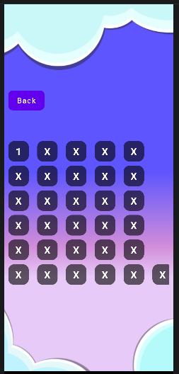
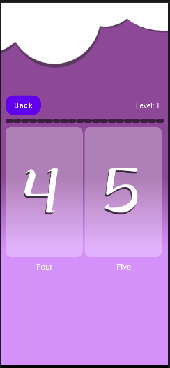
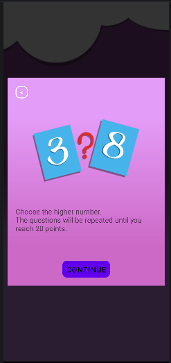

# QuiZGeeK – Android Trivia Game

QuiZGeeK is a Java-based Android trivia game designed to test number comparison skills in an engaging and interactive way.

The player must choose the higher number and reach 20 points to win.

---

## 🎮 Gameplay Overview

- Choose the higher number
- Earn points for correct answers
- Questions repeat until reaching 20 points
- Simple and clean UI
- Level-based progression

---

## 📱 Screenshots

### 🏠 Start Screen

### 📊 Level Selection

### 🧠 Game Board

### 📘 Tutorial Screen

---

## ⚙️ Features

- Structured Activity lifecycle handling
- Score tracking system
- Dynamic number generation
- Clean UI/UX design
- Lightweight performance
- Signed Release APK available

---

## 🛠 Tech Stack

- Java
- Android SDK
- Gradle
- XML Layout System

---

## 📦 Download

You can download the latest signed APK here:

🔗 [Download APK](https://github.com/arakel-programs/QuiZGeeK/releases/download/v1.0.0/app-release.apk)

Release page:

🔗 [View Release](https://github.com/arakel-programs/QuiZGeeK/releases/tag/v1.0.0)

---

## 🚀 Installation

1. Download the APK file.
2. Enable "Install from Unknown Sources" on your Android device.
3. Install the application.

---

## 📌 Status

Stable release – v1.0.0  
Actively maintained for portfolio demonstration.

---

Developed by **Gor Arakelyan**
